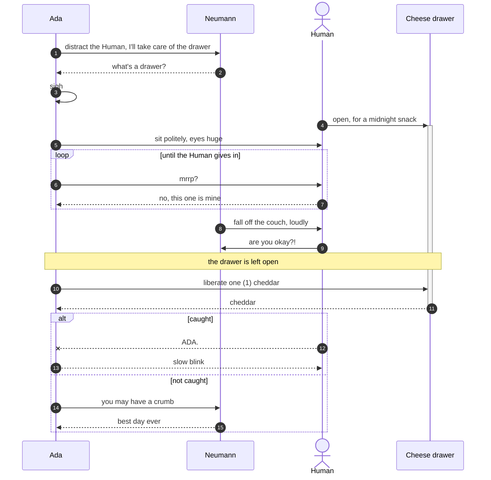
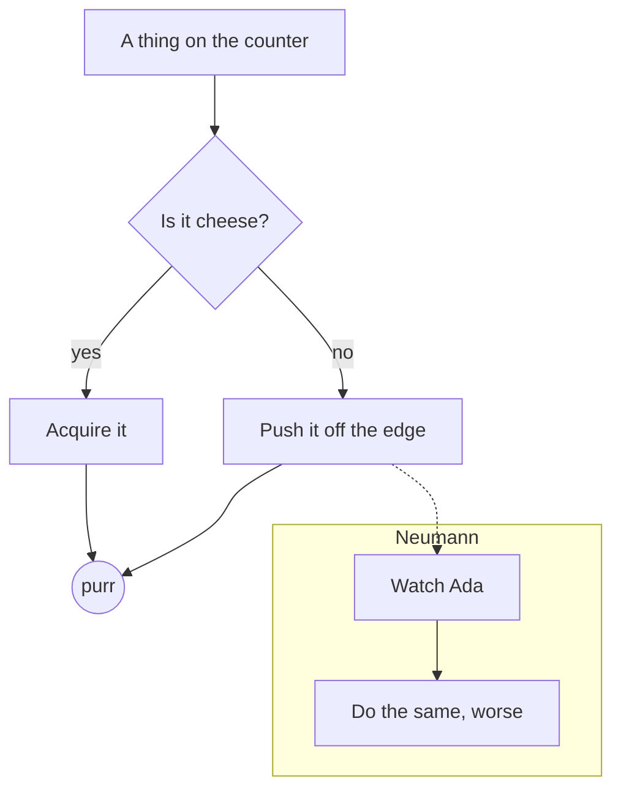
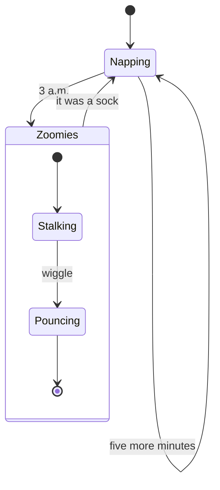

# Diagrams

Ada's operations, in mermaid. Scroll through the heist and its cast stays on top.

## The cheese heist

```mermaid
sequenceDiagram
    participant Ada
    participant Neumann
    actor Human
    participant Drawer as Cheese drawer
    autonumber
    Ada ->> Neumann: distract the Human, I'll take care of the drawer
    Neumann -->> Ada: what's a drawer?
    Ada ->> Ada: sigh
    Human ->>+ Drawer: open, for a midnight snack
    Ada ->> Human: sit politely, eyes huge
    loop until the Human gives in
        Ada ->> Human: mrrp?
        Human -->> Ada: no, this one is mine
    end
    Neumann ->> Human: fall off the couch, loudly
    Human ->> Neumann: are you okay?!
    Note over Ada,Drawer: the drawer is left open
    Ada ->> Drawer: liberate one (1) cheddar
    Drawer -->>- Ada: cheddar
    alt caught
        Human --x Ada: ADA.
        Ada -->> Human: slow blink
    else not caught
        Ada ->> Neumann: you may have a crumb
        Neumann -->> Ada: best day ever
    end
```

## What to do with a thing on the counter

```mermaid
flowchart TD
    A[A thing on the counter] --> B{Is it cheese?}
    B -->|yes| C[Acquire it]
    B -->|no| E[Push it off the edge]
    C --> G((purr))
    E --> G
    subgraph neumann [Neumann]
        N1[Watch Ada] --> N2[Do the same, worse]
    end
    E -.-> N1
```

## A day in the life

```mermaid
stateDiagram-v2
    [*] --> Napping
    Napping --> Napping : five more minutes
    Napping --> Zoomies : 3 a.m.
    state Zoomies {
        [*] --> Stalking
        Stalking --> Pouncing : wiggle
        Pouncing --> [*]
    }
    Zoomies --> Napping : it was a sock
```
