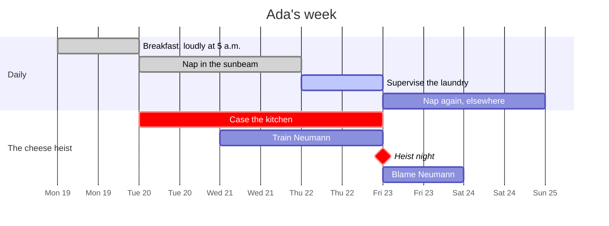

# The week ahead

Ada's plans for the week, in mermaid.

```mermaid
gantt
    title Ada's week
    dateFormat YYYY-MM-DD
    axisFormat %a %d
    section Daily
        Breakfast, loudly at 5 a.m.    :done, b, 2026-10-19, 1d
        Nap in the sunbeam             :done, n1, after b, 2d
        Supervise the laundry          :active, l, after n1, 1d
        Nap again, elsewhere           :n2, after l, 2d
    section The cheese heist
        Case the kitchen               :crit, k, 2026-10-20, 3d
        Train Neumann                  :t, 2026-10-21, 2d
        Heist night                    :crit, milestone, h, after k t, 0d
        Blame Neumann                  :after h, 1d
```
